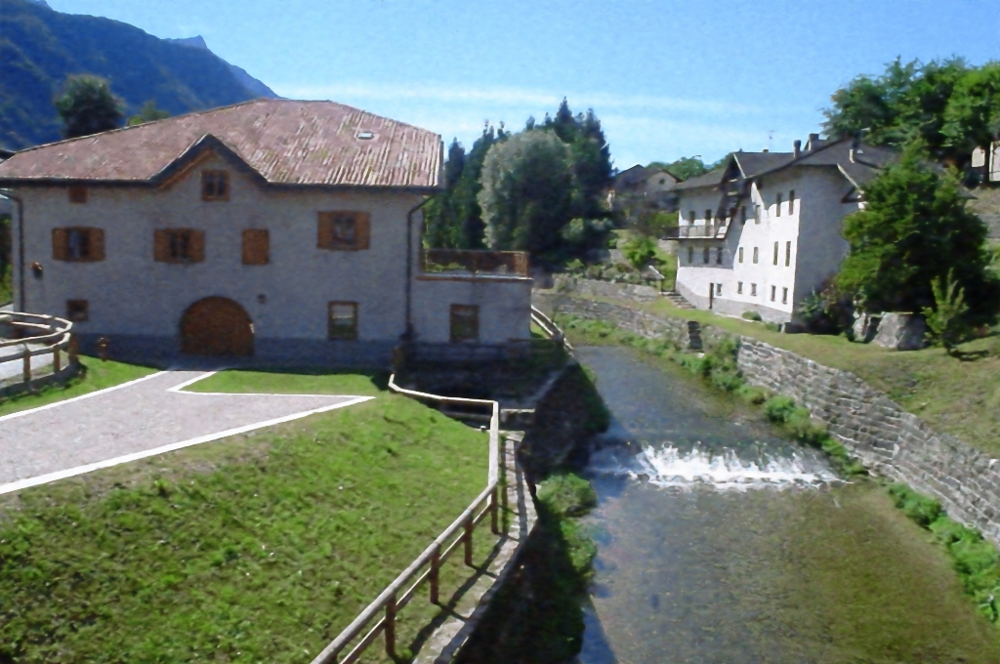

### DeepPic: Neural Network-based Image Approximation Project
Reference image
 

Decoded image


#### Overview:
DeepPic is a project aimed at demonstrating how to approximate an image using a continuous function based on a dense neural network. The neural network takes pixel coordinates (x, y) as inputs and predicts the corresponding RGB values, showcasing the ability to represent images as continuous functions.

#### Functionality:
The core functionality of DeepPic involves training a dense neural network to approximate the RGB values of an image based on its pixel coordinates. The trained model maps pixel coordinates to RGB values, showcasing the capability of neural networks to represent complex functions.

#### Example Files:
The repository contains various example files illustrating different aspects of the project. The file `fifth.png` demonstrates the approximation result obtained after training the model for 400 epochs on a subsample of pixels.

#### Optimization for Apple Metal:
The code is optimized to leverage Apple Metal for enhanced performance on Apple devices.

#### Usage:
To run the project, use the following command:
```
streamlit run <filename.py>
```
Replace `<filename.py>` with the name of the file containing the Streamlit application for the DeepPic project.

#### Note:
This project serves as an educational example of approximating an image using a continuous function represented by a dense neural network. It does not involve image colorization but focuses on demonstrating the representation of images as continuous functions.